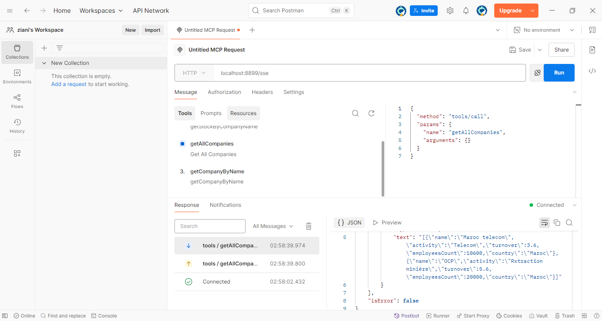
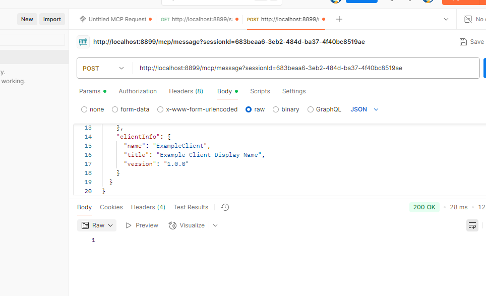
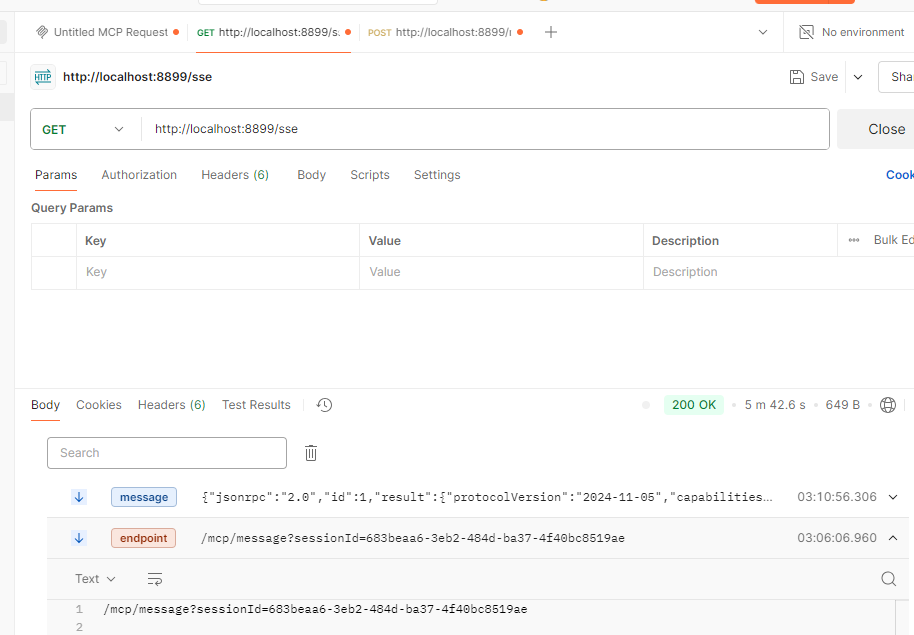
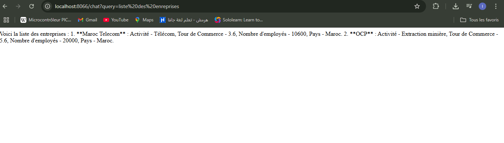
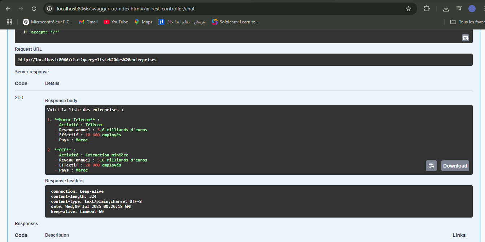
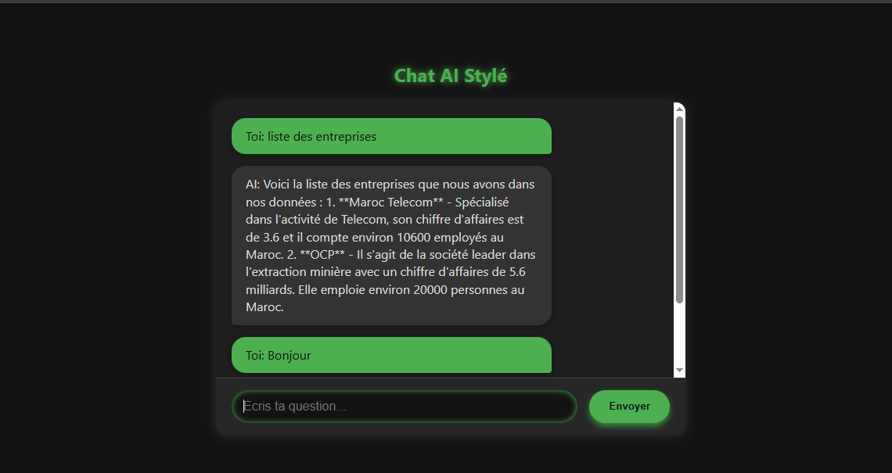

# Rapport de Projet – MCP AI Agents (Java + Python)

## Introduction

Dans ce projet, j’ai développé une application basée sur le protocole **MCP (Model Context Protocol)**, permettant la communication entre un **agent intelligent en Java (Spring Boot)** et un **serveur Python** contenant des outils.  
L’objectif est de simuler un système **agentique**, inspiré des intelligences artificielles modernes telles que ChatGPT, Claude ou les agents LangChain.

---

## Ce que j’ai réalisé

### 1. Développement du client agent Java

J’ai utilisé Spring Boot pour créer une application Java jouant le rôle d’**agent intelligent**, capable de :

- S’identifier auprès d’un serveur distant (initialisation MCP) ;
- Écouter les événements via une connexion **SSE (Server-Sent Events)** ;
- Découvrir dynamiquement les outils disponibles via `tools/list` ;
- Appeler un outil spécifique via `tools/call`, en lui envoyant des paramètres.

Ce client est configurable via un fichier `application.properties` et peut se connecter à plusieurs serveurs d’outils.

---

### 2. Développement du serveur Python

Le serveur Python simule une **plateforme d’outils distants**.  
Il intègre plusieurs outils comme `hello`, `sum`, `echo`, etc.  
Il expose deux endpoints principaux :

- `/sse` : envoie des événements à l’agent via SSE ;
- `/tools/call` : répond aux appels d’outils effectués par l’agent.

Ce serveur reste simple et extensible, permettant l’ajout d’outils supplémentaires facilement.

---

### 3. Utilisation du protocole MCP

Le projet suit le **cycle de vie MCP** :

- `InitializationRequest` : l’agent s’identifie ;
- `InitializationResponse` : le serveur confirme l’enregistrement ;
- `tools/list` : l’agent récupère la liste des outils disponibles ;
- `tools/call` : l’agent appelle dynamiquement un outil distant avec des paramètres.

Ce mécanisme illustre comment un agent peut **raisonner de manière autonome** et **interagir dynamiquement** avec un environnement d’outils.

---

## Configuration et environnement

- **Langages utilisés** : Java 17, Python 3.10  
- **Framework** : Spring Boot  
- **Protocole de communication** : HTTP + SSE  
- **Environnement de développement** : IntelliJ IDEA  
- **Ports utilisés** :
  - Serveur Python : `8899`
  - Client Spring Boot : `8066`

Le fichier `application.properties` permet de configurer facilement l’URL du serveur Python ainsi que les endpoints à utiliser.

##

---

---

---

---

---

---

## Conclusion

Ce projet m’a permis de :

- Comprendre le fonctionnement des architectures agentiques modernes
- Mettre en place un **protocole de communication structuré (MCP)**
- Expérimenter la **connexion SSE** et l’échange dynamique entre des composants hétérogènes
- Intégrer Java et Python dans une solution distribuée

---
